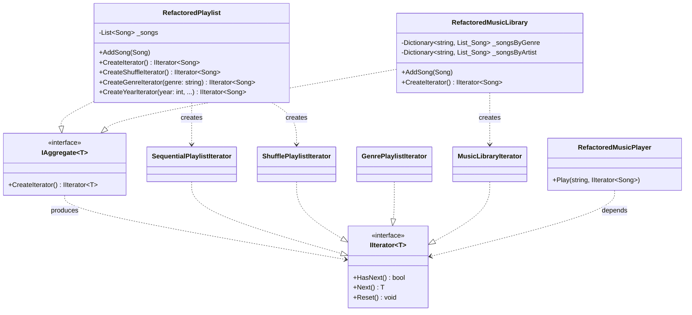

## 🥁 CarnaCode 2026 - Desafio 16 - Iterator

Oi, eu sou o Ronaldo e este é o espaço onde compartilho minha jornada de aprendizado durante o desafio **CarnaCode 2026**, realizado pelo [balta.io](https://balta.io). 👻

Aqui você vai encontrar projetos, exercícios e códigos que estou desenvolvendo durante o desafio. O objetivo é colocar a mão na massa, testar ideias e registrar minha evolução no mundo da tecnologia.

### Sobre este desafio
No desafio **Iterator** eu tive que resolver um problema real implementando o **Design Pattern** em questão.
Neste processo eu aprendi:
* ✅ Boas Práticas de Software
* ✅ Código Limpo
* ✅ SOLID
* ✅ Design Patterns (Padrões de Projeto)

## Problema
Uma aplicação de streaming precisa permitir diferentes formas de navegar por playlists (sequencial, aleatória, por gênero, filtrada). O código atual expõe a estrutura interna das coleções e repete lógica de iteração em vários lugares.

## Solução (O Padrão Iterator)
O padrão **Iterator** (Iterador) foi aplicado para separar o comportamento de travessia e filtragem da estrutura de dados da coleção principal.

Com a refatoração, a coleção (seja uma `Playlist` simples ou uma `MusicLibrary` complexa em árvore de dicionários) não precisa mais expor suas listas internas (`List<Song>`, `Dictionary`, etc). Em vez disso, ela providencia métodos que retornam **Iteradores** específicos para cada tipo de travessia. O código cliente (`MusicPlayer`) agora depende apenas da abstração `IIterator<Song>` e possui um código **agnóstico** à estrutura, rodando um ciclo simplificado (`HasNext` / `Next`), com as seguintes vantagens:

- **Encapsulamento**: As listas internas que guardam as músicas passam a ser inteiramente privadas.
- **Princípio da Responsabilidade Única (SRP)**: A lógica de embaralhar ou filtrar por gênero é extraída da playlist e concentrada no seu próprio iterador especializado.
- **Princípio Aberto/Fechado (OCP)**: Se a aplicação precisar de uma ordem alfabética inversa amanhã, o código antigo não é tocado, apenas um novo iterador é construído.

### Etapas da Refatoração
1. **Interfaces do Padrão**: Criação de `IIterator<T>` (abstraindo o avanço e leitura) e `IAggregate<T>` (obrigando as coleções a criar um Iterador padrão).
2. **Iteradores Concretos**: Criação de iteradores especializados em sequência, embaralhamento e filtros (gênero e ano) para Playlists, e um achatador de dicionários complexos para `MusicLibrary`.
3. **Refatoração dos Objetos de Dados**: As classes `RefactoredPlaylist` e `RefactoredMusicLibrary` foram encarregadas de isolar/esconder seus dados puros, entregando apenas instâncias de iteradores mediante solicitação.
4. **Simplificação do Cliente**: O `RefactoredMusicPlayer` teve seu código enxugado, restando um único método agnóstico que consome qualquer iterador enviado.
5. **Configuração para Execução Paralela**: Configuração do novo `Program.cs` na raiz rodando tanto a versão não-refatorada quanto a nova implementação com Iterator lado a lado.

### Estrutura de Aquivos

```
src/
├── Challenge.cs                  # Código legado original (com mínimo ajuste para evitar ambiguidade no Program principal)
├── IteratorPattern.csproj        # Projeto C# Console - .NET 10
├── Program.cs                    # Ponto de entrada rodando as duas opções
├── IAggregate.cs                 # Interface Agregado
├── IIterator.cs                  # Interface Iterador Base
├── RefactoredMusicPlayer.cs      # Cliente Refatorado
├── RefactoredPlaylist.cs         # Playlist sem vazamento de varáveis (Agregado)
├── RefactoredMusicLibrary.cs     # Biblioteca estuturada por Listas e Dicionários sem vazamento de varáveis
├── SequentialPlaylistIterator.cs # Iterador sequencial
├── ShufflePlaylistIterator.cs    # Iterador embaralhado
├── GenrePlaylistIterator.cs      # Iterador por Gênero
├── YearPlaylistIterator.cs       # Iterador por Lançamento
└── MusicLibraryIterator.cs       # Iterador de Dicionários complexos
```

### Diagrama de Classes (Mermaid)



## Sobre o CarnaCode 2026
O desafio **CarnaCode 2026** consiste em implementar todos os 23 padrões de projeto (Design Patterns) em cenários reais. Durante os 23 desafios desta jornada, os participantes são submetidos ao aprendizado e prática na idetinficação de códigos não escaláveis e na solução de problemas utilizando padrões de mercado.

### eBook - Fundamentos dos Design Patterns
Minha principal fonte de conhecimento durante o desafio foi o eBook gratuito [Fundamentos dos Design Patterns](https://lp.balta.io/ebook-fundamentos-design-patterns).

### Veja meu progresso no desafio
[Repositório central](https://github.com/ronaldofas/balta-desafio-carnacode-2026-central)
